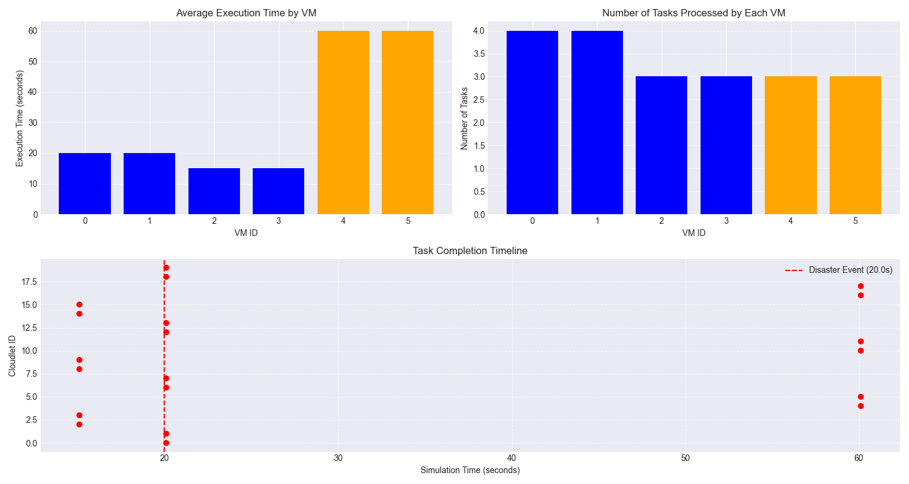
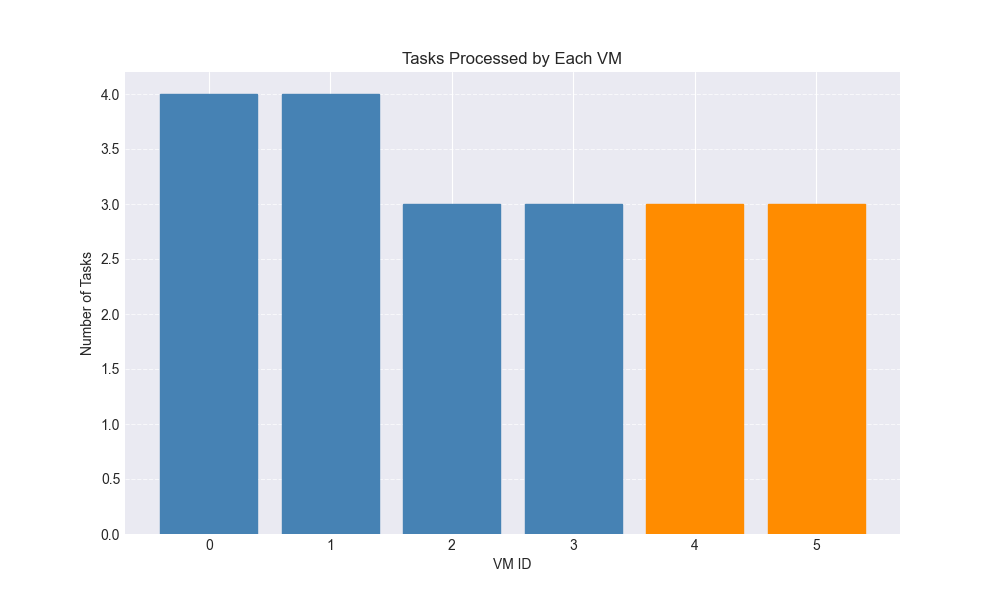

# Disaster Recovery Simulation Results

## Summary Statistics

- Total tasks processed: 20
- Tasks affected by failover: 0 (0.0%)
- Average execution time: 30.50 seconds
- Average wait time: 0.00 seconds

- Disaster event occurred at time: 20.0 seconds
- Tasks rerouted to backup datacenter: 0

## Failover Analysis

A disaster event occurred at simulation time 20.0, however none of the tasks were affected by the failover.
This suggests that either:
1. All tasks had already completed before the disaster
2. The remaining tasks were able to continue execution without interruption
3. The backup datacenter successfully handled the workload with minimal impact

## Performance Metrics Visualization

## VM Utilization

